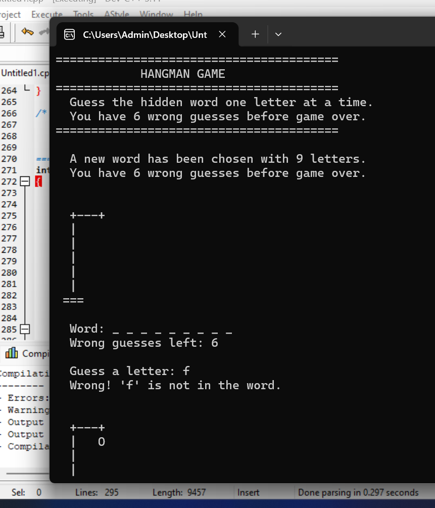
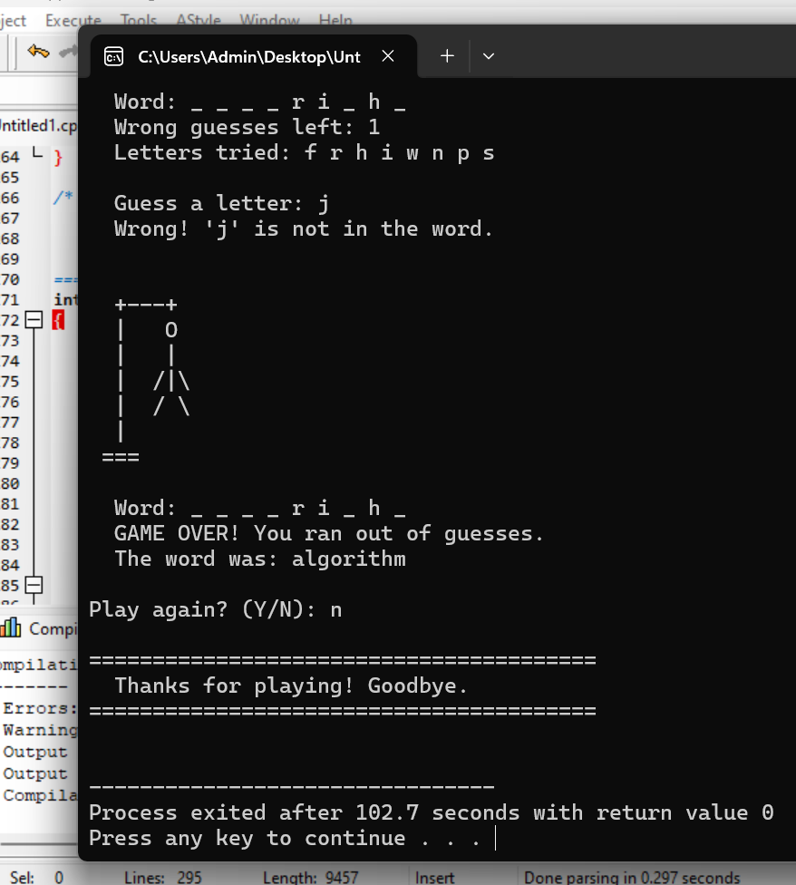

# Hangman Game in C

A console-based Hangman game built in C. The computer picks a random word from a predefined word bank and the player guesses one letter at a time. A classic game — but building it taught me how strings, char arrays, and parallel arrays actually work in C.

---

## Screenshots





---

## Why I Built This

My first project used `int` arrays and random numbers. My second used structs. This project introduced something new — working with **strings as character arrays** and using **two arrays in parallel** to track a word and its revealed state at the same time. That was the real challenge and the real lesson.

I also wanted to build something visual. The ASCII hangman figure that builds step by step made this the most satisfying project to test so far.

---

## What the Game Does

- Picks a random word from a 10-word bank every round
- Displays the word as underscores — one per letter
- Accepts one letter guess at a time from the player
- Reveals correct letters at every matching position in the word
- Tracks wrong guesses and builds the hangman figure step by step
- Rejects letters already tried — without counting it as a wrong guess
- Player wins if the full word is revealed before 6 wrong guesses
- Player loses when the hangman is complete — the word is revealed
- Asks to replay after every round

---

## How to Run It

**You need GCC installed. Check with:**
```bash
gcc --version
```

**Compile:**
```bash
gcc hangman.c -o hangman
```

**Run:**
```bash
./hangman
```

---

## How I Built It — 4 Commit History

**Commit 1 — Project setup and random word selection**
Created `hangman.c`, wrote the welcome banner, built the `word_bank[]` array, and wrote `choose_random_word()` using `rand() % WORD_COUNT`. Added a temporary debug print to confirm a different word was chosen every run. Removed it next commit.

**Commit 2 — Letter guessing, progress display, and word reveal**
This was the most educational commit. Added `string.h` and used `strlen()` for the first time to measure word length. Built the `progress[]` array — same length as the word, filled with `'_'` at the start. Wrote `display_word_progress()` to print it and `update_progress()` to reveal letters. The key insight here: two arrays of the same length running in parallel — `word[]` holds the truth, `progress[]` holds what the player has discovered so far.

**Commit 3 — Hangman drawing, attempt tracking, and duplicate detection**
Added `draw_hangman()` — the ASCII figure builds one body part per wrong guess using `if/else if` chains. Added the `guessed[]` array to store every letter tried and a loop to check for duplicates before accepting a new guess. Rejecting a duplicate does not count as a wrong guess — that detail matters for fairness.

**Commit 4 — Win/lose conditions, replay, and goodbye**
Moved all game logic into `play_game()` to keep `main()` clean. Added the win check — after every correct guess it counts remaining underscores. When zero remain the player wins. Added the lose condition — when `wrong` hits `MAX_WRONG` the loop ends naturally. Added `ask_play_again()` with Y/N validation and wrapped everything in a `do-while` replay loop.

---

## What I Learned

**Strings are char arrays** — there is no special string type in C. A word is just `char word[]` with a `'\0'` at the end. `strlen()` counts characters until that null terminator.

**Parallel arrays** — `word[]` and `progress[]` are the same length and the same index always refers to the same letter position. That is the entire mechanic of the game. Simple but powerful.

**`update_progress()` loops the whole word** — a letter might appear more than once. The function does not stop at the first match — it keeps going and reveals every occurrence. That is why guessing `'o'` in `"monitor"` reveals both the `o` positions at once.

**ASCII art with `if/else if`** — `draw_hangman()` has no arrays or loops. Just conditions. Each body part has a threshold — when `wrong` reaches it, that part prints. Building up visuals this way felt very satisfying.

**`return` inside a void function** — used `return` inside `play_game()` to exit the function early when the player wins. Cleaner than using a flag variable and breaking out of the loop.

---

## Project Structure

```
hangman-game-c/
├── hangman.c
├── README.md
└── screenshots/
    ├── gameplay.png
    └── win-screen.png
```

---

## Tech

- **Language:** C (C99)
- **Compiler:** GCC
- **Libraries:** `stdio.h`, `stdlib.h`, `string.h`, `time.h` — standard library only

---

## Connect

[](https://www.linkedin.com/in/muhammad-ramzan-bb63233aa/)
[](mailto:mramzan14700@gmail.com)

---

*Fourth project in my C portfolio. Built commit by commit as part of learning strings and arrays in C.*